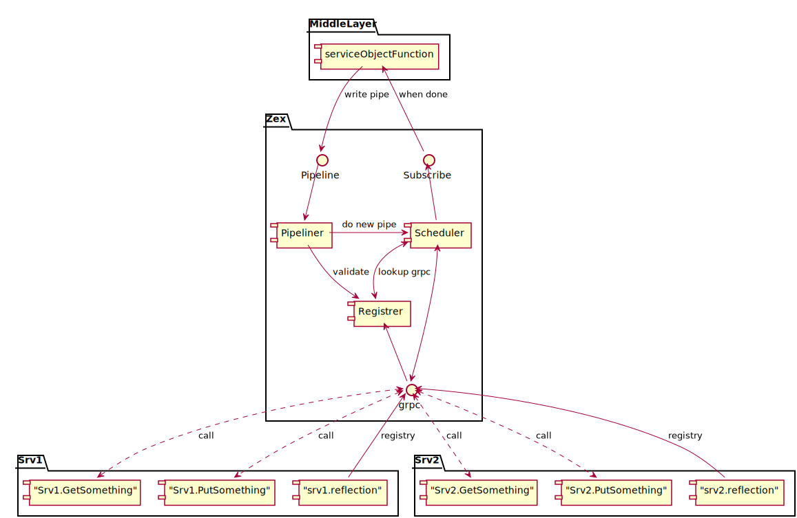

# Overview

## Concept

Zex позволяет использовать grpc сервисы, которые предоставляют интерфейс reflection, для распределенного выполнения разного рода задач.

Например у вас есть grpc сервис, который отдает пользователей по стриму и есть другой grpc сервис groups и он имеет метод позволяющий
добавлять пользователя по его id в group. И допустим у вас есть несколько милионов пользователей и вы точно не хотите это выполнять по какой-от ручке,
но хотите что бы эта задача было выполенена и при этом вы хотите распределить всех пользоватлей по своему алгоритму по группам. Zex поможет вам в этом.

Вы напишите всё такой же код на grpc клиентах, только будет просиходить запись папйлайна в цех. Zex сохранит ваш пайп как задучу на выполнение.
При это поймет как нужно обработать задачу на выполение, где можно распоралелить вычисления. А где можно за ранее выполнить загрузку данных.

Также есть настройка повторов, отмен операций и даже прогресс прохождения операций

+ также есть хорошая выдача статистики
+ также opentracing в коробке, вы можете посмотреть весь граф вызовов и тем самым лучше понять как происходит выполение.

Также это позволяет использовать любые ресурсы и обрабочики их

Возможно так zex ьбудет уметь испольнять аля serviceless

## Слои

### Клиент

Нужно будет написать генератор для работы тех же самых интерфейсов только с отправкой данных не сраву сервису, а записи в пайп в zex.

### Zex

#### Pipiline Recorder (WAL service)

важный момент в том что когда мы записываем пайплайн мы валидируем тот момент что подобные сервисы уже регистрировались

в цехе и мы знаем что сможем найти такие методы хоть когда либо, когда сервисы потом будут доступны для цеха

также пайплайн можен запсываться

 - просто в память принимающего сервиса zex-1
 - просто в память принимающего сервиса zex-1 и реплицироваться соседниму zex-n сервисов
 - на диск принимающего сервиса zex-1
 - на диcк принимающего сервиса zex-1 и реплицироваться соседниму zex-n сервисов

#### Proxy / Service Registrator

Пользоляют сервисам зарегистриваться к zex и zex в zex :)

для постороения дерева , ни чего не мешает и регистрироваться другому zex-n в zex-1

### Scheduler

Запускает PipilineN готовый для выполнения и следит за выполнениями всех запущеных Pipilineов

### Что может пользователь ?

-  может записать пайплан с параметрами
   - сразу после записи в зависимости от параметров он попадет на в scheduler на исполнение
   - в параметах могут быть разные условия, например
      - как исполнять - опция при создании  пайпа
        - отложенные запуск по таймеру или дата
        - когда все сервисы будут доступны для выполнения сценария
        - ручной запуск
      - где хранить
        - память
        - диск
        - репликация
      - план повторов и доведения до конца при ошибках
        - по deadline - то есть будет пытаться выполнить пока не наступит такое-то время
        - по timeout - пока не пройдет такое-то время
        - количетсво
        - также можно указывать в опция вызова каждого метода
      - ограничение по ресурсам на стороне scheduler
        - память
        - процессор
        - диск
      - сохранить артефакты выполнения задач
        - все что нужно сохранить и вернуть как результат передается при закрытии пайплайны
        - часть переменных сохраняется, так как они могут требоваться для выполнения пайпа как такового

 - подписаться на события пайплайна

    - выполенен
    - пройден очередной этап

 - забрать артефакты пайплайна

 - отменить пайплайн во время его выполнения
   - тут идея очень простая:
      все зависит от вас , то как вы реализоывали отмену ручки
       например
         - если у вас есть ручка GetUser(ID) (User) понятное что отмена повлияет на ней , только в момент её использования
         - если у вас есть ручка PutUser(User) (error) - то отмена будер работать также только в момент исплнения её
         - если вы хотите распределенную транзакцию, то мы предлагаем использовать стрим
            - PutterUser(stream User) (error) - то гда в рамках выполнения пайпа будет открыт стрим и он закроется или отзавется
             только по завершению пайпа, в тот момент , когда пайп завершиться весь и будет принято решение
              - отменить
              - или просто закрыть - успешное завершение по умолчанию

### Планируется поддержка GraphQL

### Распределность

мы уже поняли что для того чтобы создать пайп и сохранить его данные и не потерять - мы будем использовать реплизирование
в другие цеха.

У цеха нету мастеров или слейвов - оно все индивидуельно для каждого пайпа.

Идея такая - у вас есть 7 цехов

вы отправляете пайпна выполнение во 2 цех с replicationFactor=3
и zex-2 сохраняет в zex-2, zex-3, zex-4 этот pipe-1 и передает в свой zex-2 sсheduler запуск pipe-1
и в этот момент zex-2 является мастером pipe-1. При этом scheduler-1 может задействовать zex-3,zex-4 их шедулеры для
выполнения работы паралельно. но если zex-1 падает, то мастером для pipe1 становиться или zex-3 или zex-4 и задача повтаряется.
Если даже в этот мемент zex-1 поднимится, то должен будет удалить этот пайп, только если общее количесво нод не равно=3.

Также мастер при выполение пайпа продолжит его репликацию на другую ноду.

Выбор мастера будер происходить по "цуефа" :))

Возможно стоит воообще вынести scheduler как отдельные сервисы тогда они будут сами по себе... но тут есть другие проблемки :))

